# AlphaFold3 SeqVis Toolkit

  
 [](http://makeapullrequest.com) 

A lightweight toolkit for visualizing and analyzing AlphaFold3 prediction outputs.


## 📑 Table of Contents
- [Modules](#modules)
  - [Confidence Metrics](#1-confidence-metrics-plotting)
  - [Contact Map Visualization](#2-contact-map-visualization)
  - [Structure Comparison](#3-two-structures-comparison)
  - [Feature Tracks](#4-sequence-based-feature-tracks-intergrated)
  - [PyMOL Extension](#5-pymol-extension-to-color-alphafold-structures-by-confidence-plddt)
- [Installation](#how-to-install-it-)
- [Usage](#how-to-use-it-)
- [CLI Reference](#cli)
- [Test Cases](#test-cases)
- [TODOs](#-todos)

## Modules

### 1, Confidence Metrics Plotting

It is designed to visualize all confidence metrics, and we categorize the confidence metrics produced by AlphaFold3 into 2 types: 
one is the global confidence metric, and the other is the local confidence metric. 

For details about every metric below, please refer to [Interpreting results from AlphaFold Server](https://www.ebi.ac.uk/training/online/courses/alphafold/alphafold-3-and-alphafold-server/alphafold-server-your-gateway-to-alphafold-3/interpreting-results-from-alphafold-server/)  | [Frequently asked questions about AlphaFold](https://alphafold.ebi.ac.uk/faq#faq-12)

⚠️ Note: There may be NULL values in the following metrics, so we will convert them to NaN (these values may appear as NA when output, and this handling also applies to plotting). Therefore, if you are confused about the output, it is recommended to first check your original data.

#### **global confidence metrics** 

In **`fold_{YOUR_JOB_NAME}_summary_confidences_{i}.json`** file

---
| Metric | Description | Visualization | Insight |
|--------|-------------|---------------|---------|
|chain_iptm|A [num_chains] array that gives the average confidence (ipTM) in the interfaces between each chain and all other chains | Output in a tsv file, and Visualized as a Line/Bar plot | This can be used for ranking predicted structures for a specific chain, when you care about where the chain binds to the rest of the complex and you do not know which other chains you expect it to interact with. This is often the case with ligands, each of which the system treats as a separate chain | 
|chain_pair_iptm|A square [num_chains, num_chains] array representing pairwise ipTM scores. The off-diagonal element (i, j) of the array contains the ipTM restricted to tokens from chains i and j. The diagonal element (i, i) contains the pTM restricted to chain i|Visualized as a heatmap| The array can be used for ranking predictions of a structure by the accuracy of a specific interface between two chains that you know interact, e.g. antibody-antigen interactions. As these values are calculated based on tokens, this metric also encompasses small molecules and chemically-modified residues and nucleotides | 
|chain_pair_pae_min|A square [num_chains, num_chains] array of PAE values. Element (i, j) of the array contains the lowest PAE value across rows restricted to chain i and columns restricted to chain j|Visualized as a heatmap| This has been found to correlate with whether or not two chains interact, so **it can be used to distinguish interacting and non-interacting molecules**. As these values are calculated based on tokens, this metric also encompasses small molecules and chemically-modified residues and nucleotides | 
|chain_ptm|A [num_chains] array. Element i contains the pTM restricted to chain i|Output in a tsv file, and Visualized as a Line/Bar plot| This can be used for ranking the predicted structures of individual chains when you are most interested in the structure of that chain, rather than its cross-chain interactions | 
|fraction_disordered| A scalar in the range 0-1 that indicates what fraction of the prediction structure is disordered, as measured by accessible surface area | Output in a tsv file| | 
|has_clash| A Boolean, i.e. a yes/no value, indicating if the structure has a significant number of clashing atoms (more than 50% of a chain, or a chain with more than 100 clashing atoms) | Output in a tsv file mentioned above| | 
|iptm| A scalar in the range 0-1 indicating predicted interface TM-score (confidence in the predicted interfaces) for all interfaces in the structure | Output in a tsv file mentioned above| | 
|num_recycles| An integer number that represents the total number of recycles | Output in a tsv file mentioned above| | 
|ptm| A scalar in the range 0-1 indicating the predicted TM-score for the full structure | Output in a tsv file mentioned above| | 
|ranking_score| A scalar ranging from -100 to 1.5 that can be used for ranking predictions. It combines ptm, iptm, fraction_disordered and has_clash into a single number with the following equation: 0.8 × ipTM + 0.2 × pTM + 0.5 × disorder − 100 × has_clash | Output in a tsv file mentioned above| |
---

In **`fold_{YOUR_JOB_NAME}_full_data_{i}.json`** file

---
| Metric | Description | Visualization | 
|--------|-------------|---------------| 
|pLDDT distribution|Proportion of Each pLDDT Confidence Region by Chain and All|Output in a tsv file| 
|Average pLDDT|Avergae plDDT score by Chain and All|Output in a tsv file mentioned above| 
---

#### **local confidence metrics**

In **`fold_{YOUR_JOB_NAME}_full_data_{i}.json`** file

---
| Metric | Description | Visualization | 
|--------|-------------|---------------|
|contact_probs|A square [num_tokens, num_tokens] array. Element (i, j) indicates the predicted probability that token i and token j are in contact, where “in contact” is defined as a maximum distance of 8Å between a system-defined representative atom for each token|Visualized as a heatmap; by default, all chains are included, and you can also select specific chains to display|
|atom_plddts|A [num_atoms] array. Element i indicates the predicted local distance difference test (pLDDT) for atom i in the prediction|Visualized as a line plot, with a pLDDT color coding for area under the curve; by default, all chains are included, and you can also select specific chains to display|
|pae|A square [num_tokens, num_tokens] array. Element (i, j) indicates the predicted aligned error (PAE) in the position of token j, when the prediction is aligned to the ground truth using the frame of token i|Visualized as a heatmap; by default, all chains are included, and you can also select specific chains to display|
| atom_chain_ids | A [num_atoms] array indicating the chain IDs corresponding to each atom in the prediction | | 
| token_chain_ids | A [num_tokens] array indicating the chain IDs corresponding to each token in the prediction | |
| token_res_ids | A [num_res] array | |

---

For pLDDT color coding


colors are defined below, for details, please refer to [I want to render my own images of the predicted structures, how do I color by pLDDT?](https://github.com/sokrypton/ColabFold?tab=readme-ov-file#faq)

```
set_color n0, [0.051, 0.341, 0.827]
set_color n1, [0.416, 0.796, 0.945]
set_color n2, [0.996, 0.851, 0.212]
set_color n3, [0.992, 0.490, 0.302]
color n0, b < 100; color n1, b < 90
color n2, b < 70;  color n3, b < 50
```
  
Notably, AlphaFold 3 calculates a pLDDT score for every individual atom in the structure. This differs from AlphaFold 2, which calculates pLDDT for each amino acid residue.

⚠️ Note: This module is alphafold3-DEPENDENT, cause the input data needed (confidence json file) is generated by alphafold3.
### 2, Contact Map Visualization

This module allows you to generate residue-residue contact heatmaps directly from an mmCIF file. It supports complex structures, enabling you to visualize interactions within the entire complex or focus on a specific chain by specifying its ID.

And we also support the **1D feature track stacking (1D-to-2D stacking)** for the relevant chain; please refer to **MODULE 4** below for specific implementation details.

⚠️ Note: This module is alphafold3-INDEPENDENT, cause the input data needed (an mmCIF file) is NOT NECESSARILY generated by alphafold3.
### 3, Two Structures Comparison

Our tool currently only supports comparing the structures of protein(s) — generated from the same sequence — under two different conditions, with a focus on analyzing the differences between these protein structural objects across conditions.

For instance, regarding a specific transcription factor, our tool allows observation of its structural changes under two conditions: when bound to DNA and when not bound to DNA.

⚠️ Note: This module is AlphaFold3-INDEPENDENT, as the required input data—two mmCIF files (under two different conditions, containing the same protein sequence)—is not necessarily generated by AlphaFold3.

### 4, Sequence-based feature tracks intergrated

Since proteins have numerous sequence-level features (e.g., Shannon entropy, domain annotations, intrinsically disordered region (IDR) annotations, etc.), we intend to add a dimension of sequence feature information to structure-related 2D plots for comparative visualization.

Here, we roughly categorize the input feature tracks into two classes: NUMERICAL and CATEGORICAL. Specifically, for the former (NUMERICAL features), a line plot is generally used for visualization; for the latter (CATEGORICAL features), a bar plot or strip plot is adopted. Additionally, these two types of feature tracks differ in both annotation color configurations and track size. When displayed, the feature tracks are symmetrically placed on the top and left sides of the 2D matrix plot.

For track-intergrated plotting, here we take the command `contact-map-vis-Track` as an example.

There are 2 files needed: `Bed for Track info and Json for Track color config`

- Track bed file: 5-column TSV format —— [Chain, TrackName, Start, End, Value]. This format is designed to integrate and standardize feature-related data.
  - 0-indexed
  - must have a column name row
  - value must be a numerical type or a catrgorical string

    We present a simulated track bed file generated by script [SIMULATED TRACK SCRIPT](./tests/test_data/Multi_protein_complex/simulated_tracks.py)  here: [SIMULATED TRACK FILE](./tests/test_output/visualization/track/simulated_tracks.bed)

    ```bash
    chain_id	track_name	start	end	value
    A	Disorder	0	9	0.1939202398057196
    A	Disorder	10	19	0.2661143003553823
    A	Disorder	20	29	0.09356952954622577
    A	Disorder	30	39	0.7224995256611805
    A	Disorder	40	49	0.21211383891211832
    ...
    ```

- Color config file: We strongly recommend you to use a JSON file.
  - Using {TrackName : Color config} format
  - TrackName must be consitent with "TrackName" column in Track bed file above
  - For Numerical-type Track, we recommend using single color (like "orange" or "#FF1010"), or a colormap (like "tab20")
  - For Categorical-type Track, if you know the exact number of categories and wish to assign a specific color to each category, we recommend using a detailed color dictionary. If you do not have this information (or do not need custom color assignments), we suggest using a colormap—note that the number of colors in the colormap you provide must exceed the number of categories in the track. Examples of suitable colormaps like "tab20", and we will automatically assign distinct colors from the colormap to each category for you.

    We present a simulated track color config file here: [SIMULATED COLOR CONFIG FILE](./tests/test_output/visualization/track/simulated_tracks_color_config.json)
    ```python
    import json

    color_config = {
        "Disorder": "orange",
        "Domains": {
            "N-Term": "green",
            "DNA-Binding": "red",
            "Zinc-Finger": "purple",
            "C-Term": "blue",
            "Linker": "gray"
        }
    }

    # Save color configuration
    with open("./tests/test_output/visualization/track/simulated_tracks_color_config.json", "w") as f:
        json.dump(color_config, f)
    ```

For the demonstration of results, please refer to [Test case4](#-case-4-visualizing-protein-sequence-based-feature-track-in-residue-residue-contact-map)

⚠️ Note: This module is AlphaFold3-INDEPENDENT

### 5, PyMOL extensions/plugins for Visualization

For open source Pymol installations, please refer to https://github.com/schrodinger/pymol-open-source
#### 1️⃣PyMOL extension to color AlphaFold structures by confidence (pLDDT)

Test case see [Test Case2](#-case-2-visualizing-structural-confidence-of-molecules-in-pymol), and Colors definition see Module 1 above.

#### 2️⃣A PyMOL plugin to visualize interface residues is coming soon !

## How to install it ?

## Install (dev)

```bash
git clone https://github.com/MaybeBio/AlphaFold3-SeqVisToolkit.git
cd AlphaFold3-SeqVisToolkit
pip install -e .
```


## How to use it ?

First have a look at the help message !

```bash
❯ af3-vis --help
                                                                                                                                                                                         
 Usage: af3-vis [OPTIONS] COMMAND [ARGS]...                                                                                                                                              
                                                                                                                                                                                         
 AlphaFold3 SeqVis Toolkit                                                                                                                                                               
                                                                                                                                                                                         
╭─ Options ─────────────────────────────────────────────────────────────────────────────────────────────────────────────────────────────────────────────────────────────────────────────╮
│ --install-completion          Install completion for the current shell.                                                                                                               │
│ --show-completion             Show completion for the current shell, to copy it or customize the installation.                                                                        │
│ --help                        Show this message and exit.                                                                                                                             │
╰───────────────────────────────────────────────────────────────────────────────────────────────────────────────────────────────────────────────────────────────────────────────────────╯
╭─ Commands ────────────────────────────────────────────────────────────────────────────────────────────────────────────────────────────────────────────────────────────────────────────╮
│ confidence                Plot global (ipTM/pTM etc.) and/or local (PAE/contact/atom pLDDT) confidence metrics.                                                                       │
│ contact-map-diff          Compare contact maps between two AlphaFold3 mmCIF structures for the same protein sequence, and plot the distance/diff matrices.                            │
│ contact-map-vis-Track     Visualize contact map from an AlphaFold3 mmCIF structure or a general mmCIF structure with customizable feature annotation tracks.                          │
│ contact-map-vis-noTrack   Visualize contact map from an AlphaFold3 mmCIF structure or a general mmCIF structure without feature annotation tracks.                                    │
╰───────────────────────────────────────────────────────────────────────────────────────────────────────────────────────────────────────────────────────────────────────────────────────╯
```

* As you can see, our toolkit currently supports 4 modules talked above


## CLI

```bash
af3-vis --help
af3-vis contact-map-diff --help
...
```

## Programmatic API (Under Development)

```python
from alphafold3_seqvis_toolkit import contact_map_diff
```


## Test Cases

The following examples are provided to help you get started quickly.


### 🧬 Case 1: Validating DNA-Protein Complexes

**❓ The Question:**
How to validate AlphaFold3's DNA-protein complex predictions for chain A (protein) and M+N (DNA)?

> *   Should we prioritize **pLDDT scores** for chain A's protein domains and **ipTM** for M/N-DNA interfaces?
> *   What confidence thresholds matter most—chain A's local pLDDT (>90?) or M+N interface PAE (<10Å)?
> *   Can we trust predicted interactions between chain A (residues 1-300) and M/N if their interface pLDDT drops below 70?
> *   Do AF3's pLDDT/ipTM scores validate chain A-M/N interactions?

**✅ The Solution:**
Run the confidence analysis module to generate global and local metrics for these specific chains:

```bash
af3-vis confidence --global-json ./tests/test_data/CTCF_withDNA/fold_flznwitha6csedna_summary_confidences_0.json --full-json ./tests/test_data/CTCF_withDNA/fold_flznwitha6csedna_full_data_0.json -o ./tests/test_output/confidence -c A -c M -c N
```
In output directory, there will be several files generated, you can see them at [`./tests/test_output/confidence`](./tests/test_output/confidence)

For images, in addition to pdf format output, we also provide png format.

```bash
❯ tree -h ./tests/test_output/confidence
[4.0K]  ./tests/test_output/confidence
├── [ 22K]  flznwitha6csedna_global_confidence_chain_pair_iptm_heatmap.pdf
├── [ 20K]  flznwitha6csedna_global_confidence_chain_pair_pae_min_heatmap.pdf
├── [ 14K]  flznwitha6csedna_global_confidence_chain_ptm_iptm_barplot.pdf
├── [ 16K]  flznwitha6csedna_global_confidence_chain_ptm_iptm_lineplot.pdf
├── [ 201]  flznwitha6csedna_global_confidence_chain_ptm_iptm.tsv
├── [ 107]  flznwitha6csedna_global_confidence_SCALAR_measures.tsv
├── [322K]  flznwitha6csedna_local_confidence_atom_plddt_selected_chains_A_M_N.pdf
├── [ 84K]  flznwitha6csedna_local_confidence_contact_probability_matrix_selected_chains_A_M_N.pdf
├── [ 723]  flznwitha6csedna_local_confidence_overall_atom_plddt_statistics.tsv
└── [446K]  flznwitha6csedna_local_confidence_PAE_matrix_selected_chains_A_M_N.pdf

1 directory, 10 files
```

The above results are presented in order below:


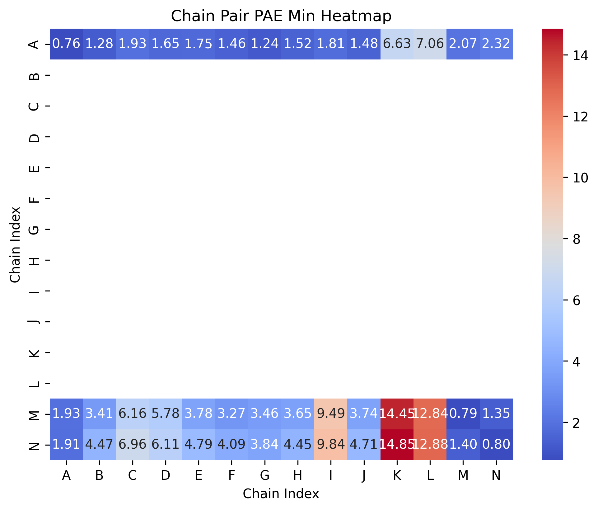

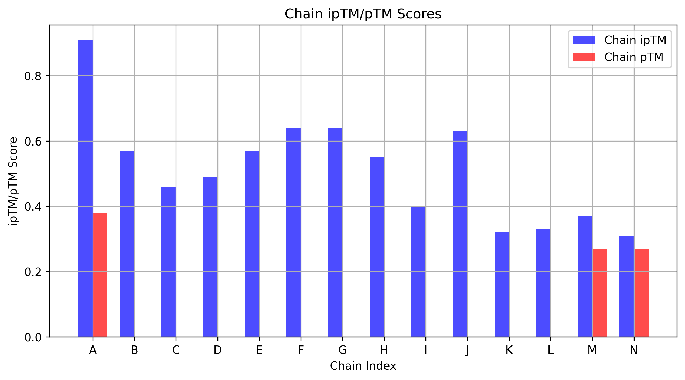


```
Chain_Index	Chain_ipTM_Score	Chain_pTM_Score
A	0.91	0.38
B	0.57	nan
C	0.46	nan
D	0.49	nan
E	0.57	nan
F	0.64	nan
G	0.64	nan
H	0.55	nan
I	0.4	nan
J	0.63	nan
K	0.32	nan
L	0.33	nan
M	0.37	0.27
N	0.31	0.27
```

```
Fraction Disordered	0.58
Has Clash	0.0
ipTM	0.74
Number of Recycles	10.0
pTM	0.43
Ranking Score	0.97
```

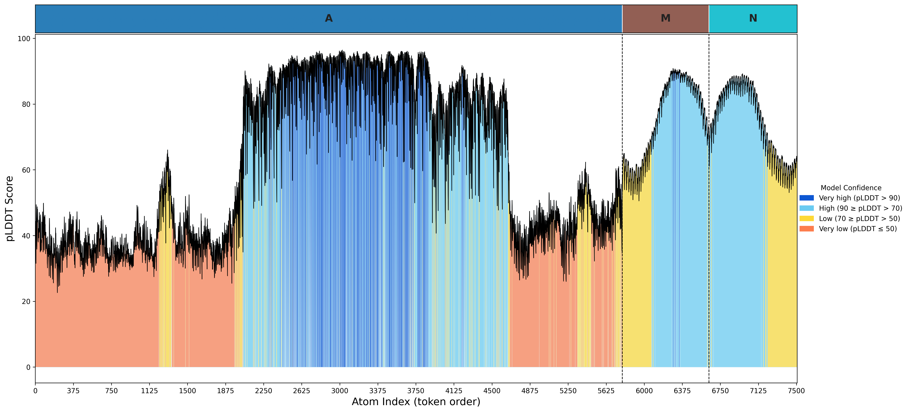


```
Chain_ID	Mean_pLDDT	Median_pLDDT	Std_pLDDT	Fraction_Very_High(>90)	Fraction_High(90-70)	Fraction_Low(70-50)	Fraction_Very_Low(<=50)
All	63.73	64.24	22.04	0.13	0.33	0.17	0.38
A	60.30	51.05	23.26	0.17	0.24	0.11	0.49
B	94.32	94.32	0.00	1.00	0.00	0.00	0.00
C	81.83	81.83	0.00	0.00	1.00	0.00	0.00
D	82.27	82.27	0.00	0.00	1.00	0.00	0.00
E	88.09	88.09	0.00	0.00	1.00	0.00	0.00
F	93.53	93.53	0.00	1.00	0.00	0.00	0.00
G	94.12	94.12	0.00	1.00	0.00	0.00	0.00
H	92.41	92.41	0.00	1.00	0.00	0.00	0.00
I	74.64	74.64	0.00	0.00	1.00	0.00	0.00
J	92.16	92.16	0.00	1.00	0.00	0.00	0.00
K	62.98	62.98	0.00	0.00	0.00	1.00	0.00
L	70.34	70.34	0.00	0.00	1.00	0.00	0.00
M	75.49	78.63	12.07	0.03	0.62	0.35	0.00
N	74.75	77.10	10.78	0.00	0.63	0.37	0.00
```
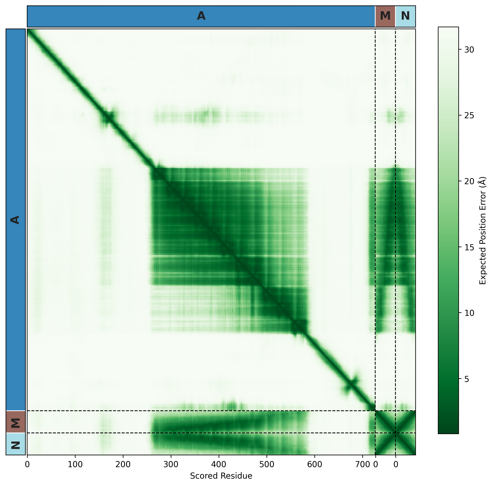


### 🧬 Case 2: Visualizing Structural Confidence of Molecules in PyMOL

**❓ The Question:**
How can I visualize and check the confidence score of each specific structural region in PyMOL?

**✅ The Solution:**
Run the ./pymol_utils/af3_plddt_color.py script:

1. Load YOUR prediction output file into pymol. In the pymol command prompt:
```bash
load fold_{YOUR_JOB_NAME}_model_{i}.cif, model_name
```

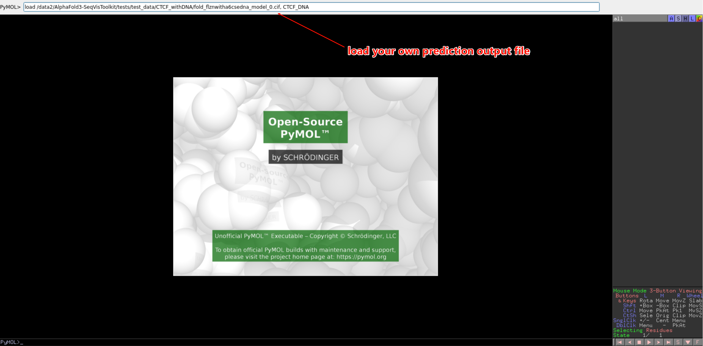

2. Load our script into pymol. In the pymol command prompt:

```bash
run ./utils/af3_plddt_color.py 
```

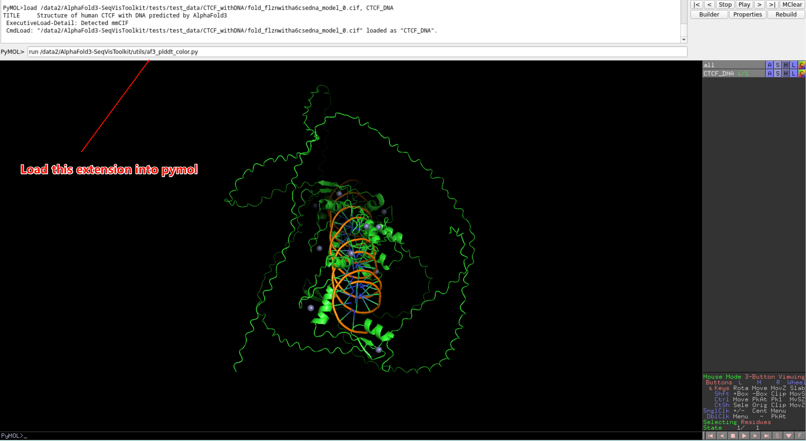

3. Invoke the script in the pymol command prompt as so:

```bash
af3_plddt_color  model_name
```

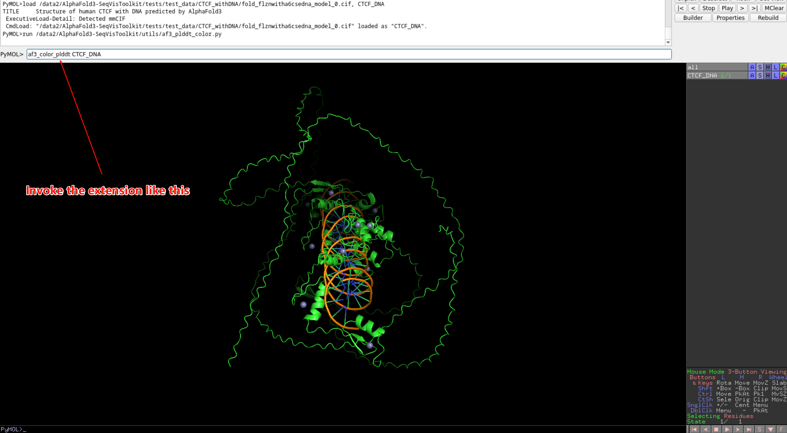

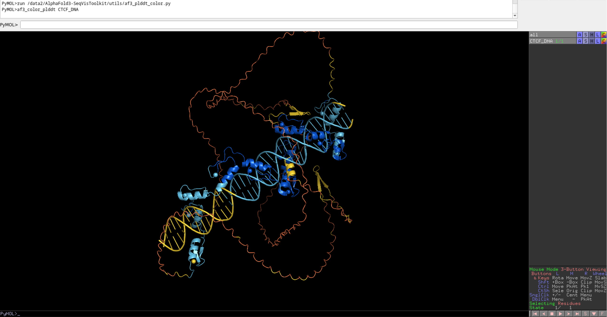

4. You can also select a specific chain to visualize:

For example, we want to color only the A chain within this CTCF-DNA complex

```bash
select CTCF_DNA_A_chain, chain A
af3_color_plddt(selection="CTCF_DNA_A_chain")

# or format like
af3_color_plddt(selection="CTCF_DNA and chain A+M+N")
```

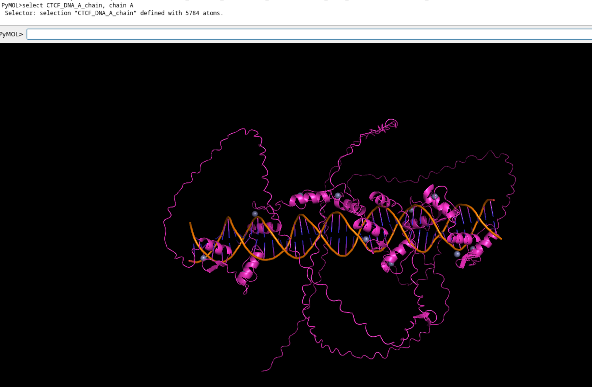
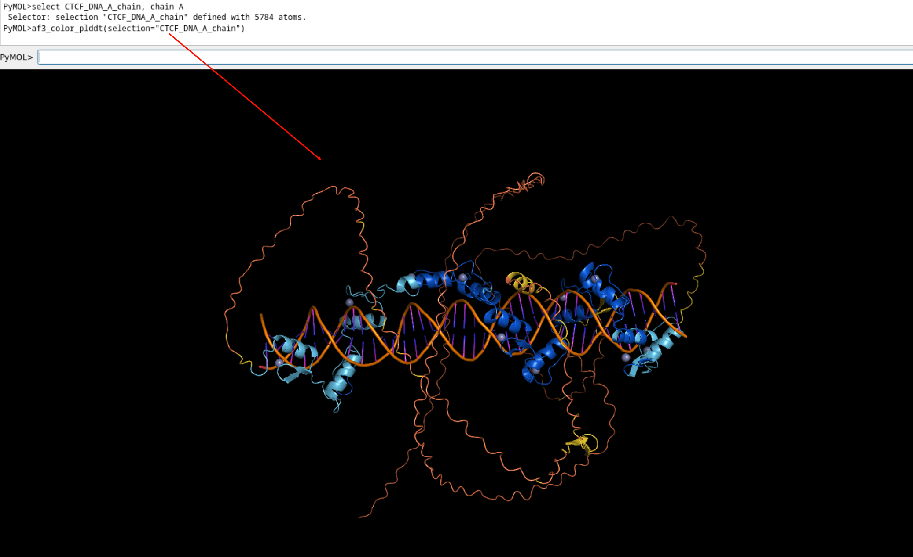
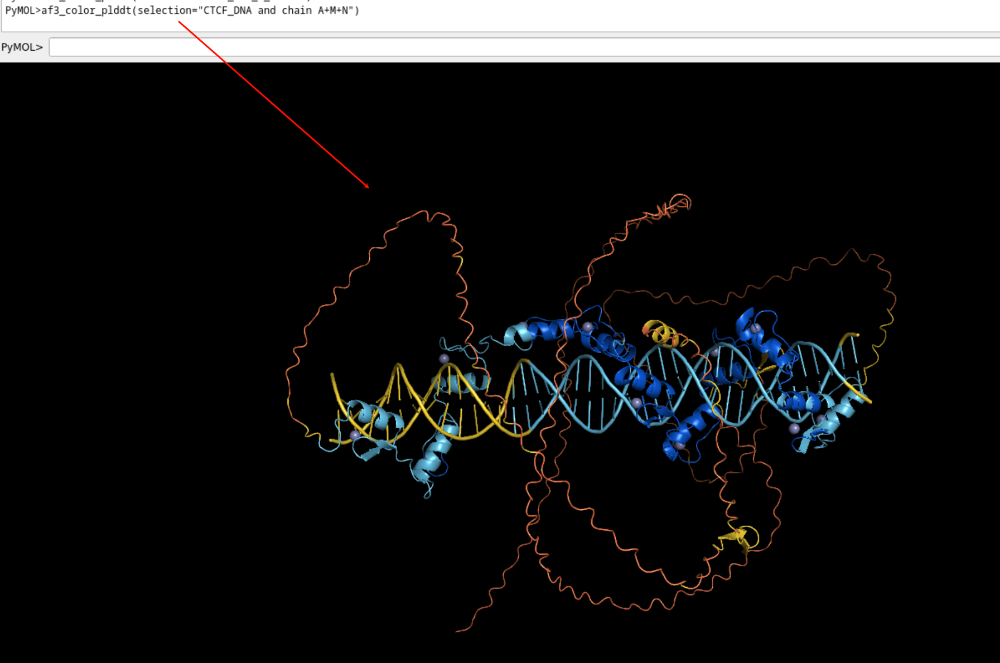


### 🧬 Case 3: Visualizing Structural Changes of Protein CTCF under TWO conditions

**❓ The Question:**
How to visualize and analyze the structural changes of the CTCF protein in two states: when it is bound to DNA, and when it is in an unbound (free) state?

> *   For example, we are interested in some specific regions, and we want to know the change of these regions, how can we visualize that?

**✅ The Solution:**
Run the contact map comparison module to CHECK the DIFFERENCE, this may give you some insight.

```bash
af3-vis contact-map-diff --mmcif-a ./tests/test_data/CTCF_withoutDNA/fold_humanwithzn_model_0.cif  --mmcif-b ./tests/test_data/CTCF_withDNA/fold_flznwitha6csedna_model_0.cif  --region-pair 265:576,0:15 --region-pair 265:576,42:54 --region-pair 265:576,83:93 --region-pair 265:576,170:189 --region-pair 265:576,214:241 --region-pair 265:576,578:589 --region-pair 265:576,606:639 --region-pair 265:576,691:720 --out-file  ./tests/test_output/comparison/contact_map_comparison.pdf
```

The regions to be compared are given symmetrically by green boxes

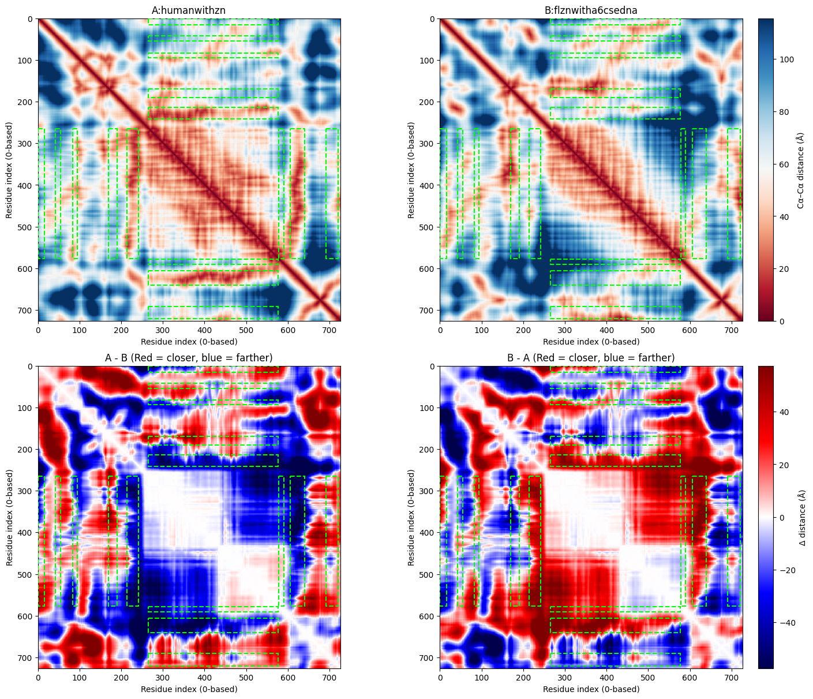

### 🧬 Case 4: Visualizing Protein Sequence-based Feature Track in residue-residue contact map

**❓ The Question:**
How can I determine which segment of a protein sequence interacts most strongly in a protein-DNA complex, what characteristics this region possesses, and whether there are any unique features of this region?

**✅ The Solution:**
Run the contact map visualization module to CHECK the interaction details, this may give you some insight.

Here, I will take a structure of [(2 CTCFs with 2 DNA strands and 22 Zn2+)](./tests/test_data/Multi_protein_complex/fold_ctcf_2_dna_model_1.cif) as an example. 
This structure has 26 chains, where chain A and chain B are protein CTCF, chain Y and chain Z are DNAs, and the remaining chains are all ion Zn2+. I just want to see how DNA and proteins interact, so we only need to see Chain A/B/Y/Z

```bash
A/B: 2 CTCF 
C~X: Zn2+
Y/Z: 2 DNA srtand
```

simply run
```bash
af3-vis contact-map-vis-noTrack --mmcif-file ./tests/test_data/Multi_protein_complex/fold_ctcf_2_dna_model_1.cif \ 
-c A -c B -c Y -c Z \
-o ./tests/test_output/visualization/notrack
```
and the output figure is like below

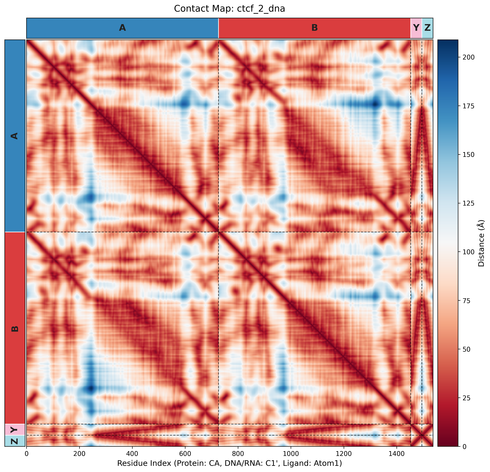

Another beautiful example see here


Regardless, assuming we possess sequence-derived feature annotations for these two proteins, our primary interest lies in exploring the structural basis underlying these features.

So we can use track information to seek further, as for contact-map-vis-Track command, 

there are 2 files needed:

- Track bed file: 5-column TSV format —— [Chain, TrackName, Start, End, Value].This format is designed to integrate and standardize feature-related data.
  - 0-indexed
  - must have a column name row
  - value must be a numerical type or a catrgorical string

    We present a simulated track bed file generated by script [SIMULATED TRACK SCRIPT](./tests/test_data/Multi_protein_complex/simulated_tracks.py)  here: [SIMULATED TRACK FILE](./tests/test_output/visualization/track/simulated_tracks.bed)

    ```bash
    chain_id	track_name	start	end	value
    A	Disorder	0	9	0.1939202398057196
    A	Disorder	10	19	0.2661143003553823
    A	Disorder	20	29	0.09356952954622577
    A	Disorder	30	39	0.7224995256611805
    A	Disorder	40	49	0.21211383891211832
    ...
    ```

- Color config file: We strongly recommend you to use a JSON file.
  - Using {TrackName : Color config} format
  - TrackName must be consitent with "TrackName" column in Track bed file above
  - For Numerical-type Track, we recommend using single color (like "orange" or "#FF1010"), or a colormap (like "tab20")
  - For Categorical-type Track, if you know the exact number of categories and wish to assign a specific color to each category, we recommend using a detailed color dictionary. If you do not have this information (or do not need custom color assignments), we suggest using a colormap—note that the number of colors in the colormap you provide must exceed the number of categories in the track. Examples of suitable colormaps like "tab20", and we will automatically assign distinct colors from the colormap to each category for you.

    We present a simulated track color config file here: [SIMULATED COLOR CONFIG FILE](./tests/test_output/visualization/track/simulated_tracks_color_config.json)
    ```python
    import json

    color_config = {
        "Disorder": "orange",
        "Domains": {
            "N-Term": "green",
            "DNA-Binding": "red",
            "Zinc-Finger": "purple",
            "C-Term": "blue",
            "Linker": "gray"
        }
    }

    # Save color configuration
    with open("./tests/test_output/visualization/track/simulated_tracks_color_config.json", "w") as f:
        json.dump(color_config, f)
    ```

Now, we can simply run
```bash
af3-vis contact-map-vis-Track --mmcif-file ./tests/test_data/Multi_protein_complex/fold_ctcf_2_dna_model_1.cif \ 
--track-bed-file ./tests/test_output/visualization/track/simulated_tracks.bed \ 
--color-config ./tests/test_output/visualization/track/simulated_tracks_color_config.json \ 
-c A -c B -c Y -c Z \ 
-o ./tests/test_output/visualization/track

```
and the output figure is like below


Now we can check the Disorder and Domain annotations in the regions we are interested in!


## 📝 TODOs 

<details>
<summary><b>Module 1: Confidence Metrics Plotting</b></summary>

> - [ ] Plotting details and token index details: 0-index for differnet chains in atom plddt figure
> - [ ] Find/mapping from mmCIF: residue/token mapping to allow residue_plddts figure. 
> 
>   Cause we do not have a residue_plddts data, and we currently did not find a way mapping atom index to residue/token index (maybe from mmCIF parser), so there is no residue_plddts figure currently
> - [ ] Scoring function for interprotein interactions in AlphaFold2 and AlphaFold3 UPDATED: We are going to use [IPSAE](https://github.com/DunbrackLab/IPSAE)

</details>

<details>
<summary><b>Module 2: Contact Map Visualization</b></summary>

> - [ ] Region Selection: see in module3-Two Structures Comparison
> - [ ] Identify local HOT SPOT rgeion (residue set whose distance < DIST threshold)
> - [ ] Index within different chains overlap with each other, especially for index 0 in following chain and end index in previous chain, maybe we can rotate the xticks_labels.

</details>

<details>
<summary><b>Module 3: Two Structures Comparison</b></summary>

> - [ ] Should consider multi-proteins complex, and we can select which chain to compare

</details>

<details>
<summary><b>Module 4: Sequence-based feature tracks intergrated</b></summary>

> - [x] What file format should we input? BED or json?
>
> **💡Solution:** We utilize a customized BED format for the input of track annotations; please refer to the INPUT Details in Module 2 for further information.
> - [x] For multi-protein complexes, each constituent protein should have a dedicated sequence-based feature track. 
> 
>   Currently, in visualizations such as residue Contact maps(module2)/PAE heatmaps(module1) and so on, our tool only supports the display of a single sequence-based feature track for one protein. Thus, it is necessary to upgrade the tool’s functionality from supporting **one protein with one track** to enabling **multiple proteins with multiple tracks**.
>
> **💡Solution:** Done in module2.

</details>

<details>
<summary><b>Module 5: Pymol Extension</b></summary>

> - [ ] Scripts to help visualize Structures in Pymol/ChimeraX including: pLDDT(Finished)/Chain/Molecule type/low PAE contacts and so on

</details>

<details>
<summary><b>Others: Maybe NEW module?</b></summary>

> - [ ] AlphaMissense predicted pathogenicity scores intergrated 
> - [ ] Mutation analysis: Like deletion, insertion, substitution and Order inversion. 
> 
>   For deletion events, a false gap will be inserted at the position of the missing residue to optimize visualization. Currently, we have not identified further avenues to deepen the mutation analysis. If you have any ideas and tricks, please feel free to contact us!
> - [ ] Free energy of folding analysis
> - [ ] mmCIF parser and further analysis —— [Bio.PDB](https://biopython.org/docs/latest/Tutorial/chapter_pdb.html)
> - [ ] Structure Alignment or Similarity search Using FoldSeek or [rcsb-embedding-model](https://github.com/rcsb/rcsb-embedding-model)

</details>


### 🤩 We warmly welcome contributions from the community to enhancing visualization for this project! If you have ideas for expanding modules above like mutation analysis, creative insights to enhance visualization, specific feature requests (e.g., PR support, workflow optimizations, or additional analytical modules), or any other suggestions to improve this work, please feel free to reach out via GitHub Issues, submit a Pull Request, or start a discussion in the Comments section. Your input will be invaluable in advancing this project!